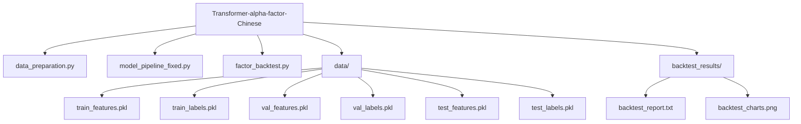

# Transformer-alpha-factor-Chinese
基于Transformer的量化交易策略（30日特征输入，70/15/15时间划分），以信息系数(IC)为核心优化目标。模型采用d_model=64/n_heads=4/num_layers=3架构，预测未来5日的因子值并用于多因子回测。

# 项目结构
下面给出项目结构的树状视图（请将此代码块直接保留在 README 中以便正确展示）：

```text
Transformer-alpha-factor-Chinese/
├── data_preparation.py       # 数据准备（特征与标签生成）
├── model_pipeline_fixed.py   # 模型训练（训练 Transformer 模型）
├── factor_backtest.py        # 因子生成与回测
├── data/                     # 保存生成的数据
│   ├── train_features.pkl
│   ├── train_labels.pkl
│   ├── val_features.pkl
│   ├── val_labels.pkl
│   ├── test_features.pkl
│   ├── test_labels.pkl
│   └── transformer_quant_data_prices.pkl
└── backtest_results/         # 回测结果
    ├── backtest_report.txt
    └── backtest_charts.png
```

# 项目特点
- 严格时间划分：训练集、验证集、测试集按时间严格划分，避免数据泄露
- IC优化：以信息系数(IC)为优化目标，直接提升预测能力
- 多维度分析：包含因子IC分析、回测绩效指标、最大回撤等全面评估
- M1 Mac优化：针对 Apple Silicon 设备进行了后端优化
- 完整回测流程：从特征生成到策略回测的完整闭环

# 快速开始
1. 安装依赖
   pip install akshare pandas numpy torch matplotlib scikit-learn
2. 数据准备
   python data_preparation.py
3. 模型训练
   python model_pipeline_fixed.py
4. 回测分析
   python factor_backtest.py

# 结果示例
策略最终净值: 1,245,678.90 元
基准最终净值: 1,050,000.00 元
策略超额收益: 195,678.90 元
策略相对收益: 18.64%

因子IC均值: 0.0324
因子信息比率(IR): 2.145

# 如何在本地生成树状结构并同步到 README
- macOS / Linux（推荐）:
  1. 安装 tree（若未安装）：brew install tree 或 sudo apt install tree
  2. 在仓库根目录运行：
     - 简单输出（包含文件和文件夹）：tree -a -L 2
     - 忽略 __pycache__ 等：tree -a -I '__pycache__' -L 2
  3. 将输出复制并粘贴到 README 中的代码块里（用 ```text 包裹以保持等宽格式）。

- Windows（命令提示符）:
  1. 在仓库根目录运行：tree /F /A
  2. 复制输出并粘贴到 README 的代码块里。

- 无 tree 命令时（使用 find）:
  find . -maxdepth 2 -print  # 然后手工调整为树状或通过脚本格式化

- 可选：使用 Mermaid 绘制更美观的树图（若平台支持 Mermaid）：



小贴士：
- 把 tree 输出保存到文件：tree -a -L 2 > tree.txt，然后打开 tree.txt 复制到 README。
- 将代码块语言设为 `text` 或 `bash` 可以确保 GitHub 显示为等宽字体并保留缩进。
- 若希望保持 README 中的��结构自动同步，可在 CI 中运行脚本生成并替换 README 的相应部分（请在提交脚本前谨慎处理 README 其他内容）。

以上为新的 README.md 内容，请将其保存为仓库根目录下的 README.md。